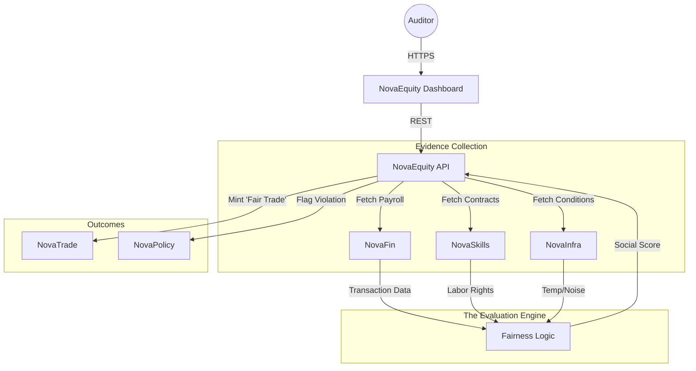

# ⚖️ NovaEquity

> **The Operating System for Social Impact.**
> Digital auditing of fair wages, labor rights, and supply chain due diligence (CSDDD).

[](https://www.google.com/search?q=https://github.com/novaeco-tech/novaequity/actions)
[](https://opensource.org/licenses/MIT)
[](https://www.google.com/search?q=https://equity.novaeco.tech)

**NovaEquity** is the Horizontal Enabler responsible for the **Social Layer**. While `NovaBalance` audits the *planet* (Carbon/Water), **NovaEquity** audits the *people* (Wages/Safety).

It connects financial data (`NovaFin`), legal contracts (`NovaSkills`), and physical conditions (`NovaInfra`) to verify that the humans powering the circular economy are treated fairly. It acts as the compliance engine for the **EU Corporate Sustainability Due Diligence Directive (CSDDD)**.

-----

## 🎯 Value Proposition

A circular economy cannot be built on exploitation. **NovaEquity** replaces self-reported PDF audits with data-driven verification:

1.  **Algorithmic Fair Pay:** Automatically verifying that payments made in `NovaFin` meet the local "Living Wage" standards for that region.
2.  **Safety Monitoring:** Using IoT sensors to detect unsafe working conditions (e.g., heat stress in a textile mill) before accidents happen.
3.  **Supply Chain Transparency:** Mapping the social risk of Tier-N suppliers (e.g., conflict minerals in `NovaTronix` electronics).

-----

## 🏗️ Architecture (The Social Audit Loop)

NovaEquity acts as a privacy-preserving auditor. It analyzes data patterns without exposing sensitive personal identities (PII).



### Integrated Services

  * **[NovaFin](https://www.google.com/search?q=https://finance.novaeco.tech):** The source of truth for payments. NovaEquity checks: "Did the coffee co-op receive the premium? Did the farm transfer that premium to the workers' wallets?"
  * **[NovaSkills](https://www.google.com/search?q=https://skills.novaeco.tech):** Provides the employment contract data. NovaEquity validates: "Does the actual working time (logged in `NovaInfra`) exceed the contracted hours?"
  * **[NovaInfra](https://www.google.com/search?q=https://infrastructure.novaeco.tech):** The safety monitor. Sensors in a `NovaRecycle` plant report noise levels and air quality. If they exceed OSHA limits, NovaEquity flags a violation.
  * **[NovaTrade](https://www.google.com/search?q=https://trade.novaeco.tech):** The incentive. Products with a high "Social Score" get a "Verified Fair Labor" badge, allowing them to sell at a premium.

-----

## ✨ Key Features

### 1\. The "Living Wage" Oracle

Real-time income verification.

  * **Input:** `NovaFin` transaction logs (anonymized) + Global Living Wage Coalition data.
  * **Analysis:** Calculates the "Wage Gap" between actual pay and the cost of living for that specific region.
  * **Output:** A pass/fail grade for the employer.

### 2\. The "Digital Whistleblower"

A secure, anonymous channel for worker feedback.

  * Workers use the `NovaSkills` wallet to submit grievances (e.g., "Forced Overtime").
  * NovaEquity aggregates these reports using Zero-Knowledge Proofs (ZKP) to protect identities while alerting the brand to systemic issues.

### 3\. Safety Pulse (IoT Auditing)

Continuous environmental monitoring for industrial sectors (`NovaMake`, `NovaTextile`).

  * **Scenario:** Temperature in a dye house exceeds 35°C for 4 hours.
  * **Action:** NovaEquity triggers a "Health Risk Alert" and downgrades the facility's social rating until cooling is improved.

### 4\. Conflict Mineral Filter

Integration with `NovaTronix` and `NovaMaterial`.

  * Traces the origin of 3TG minerals (Tin, Tungsten, Tantalum, Gold).
  * Flags supply chains that pass through high-risk zones without valid "Conflict-Free" certifications.

-----

## 🚀 Getting Started

We use **DevContainers** to provide a consistent development environment.

### Prerequisites

  * Docker Desktop
  * VS Code (with Remote Containers extension)

### Installation

1.  **Clone the repo:**
    ```bash
    git clone https://github.com/novaeco-tech/novaequity.git
    cd novaequity
    ```
2.  **Open in VS Code:**
      * Run `code .`
      * Click **"Reopen in Container"** when prompted.
3.  **Start the Enabler:**
    ```bash
    make dev
    ```
      * **Impact Dashboard:** http://localhost:3000 (For ESG Managers)
      * **API:** http://localhost:8000/docs

### Configuration (`.env`)

```ini
# Audit Standards
LIVING_WAGE_PROVIDER=GLWC # Global Living Wage Coalition
ANONYMITY_THRESHOLD=10 # Min users to aggregate data

# Integrations
NOVAFIN_URL=http://novafin-api:8000
NOVASKILLS_URL=http://novaskills-api:8000
```

-----

## 📂 Repository Structure

This is a Monorepo containing the enabler's specific logic.

```text
novaequity/
├── api/                # Python/FastAPI (Domain Logic)
│   ├── src/
│   │   ├── wages/      # Purchasing Power Parity (PPP) calc
│   │   ├── safety/     # Threshold logic for IoT sensors
│   │   └── whistle/    # Encrypted messaging handlers
├── app/                # React/Next.js Frontend (Audit UI)
│   ├── src/
│   │   ├── scorecard/  # Social Impact visualizations
│   │   └── map/        # Supply chain risk heatmap
├── website/            # Documentation (Docusaurus)
└── tests/              # Integration tests
```

-----

## 🧪 Testing

We use **Synthetic Population** testing to ensure privacy.

  * **Wage Test:** `make test-wage`
      * Generates 100 synthetic workers with varying pay rates. Asserts that the system correctly identifies the 5 workers paid below the poverty line.
  * **Privacy Test:** `make test-zkp`
      * Ensures that a whistleblower report cannot be traced back to a specific User ID in the database.

-----

## 🤝 Contributing

We need contributors with backgrounds in **Sociology**, **Data Privacy**, and **International Development**.
See [CONTRIBUTING.md](https://www.google.com/search?q=../.github/CONTRIBUTING.md) for details.

**Maintainers:** `@novaeco-tech/maintainers-enabler-novaequity`